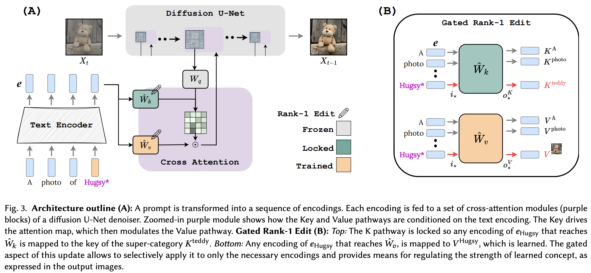

</img>

## Perfusion - Pytorch

Implementation of <a href="https://arxiv.org/abs/2305.01644">Key-Locked Rank One Editing</a>. <a href="https://research.nvidia.com/labs/par/Perfusion/">Project page</a>

The selling point of this paper is extremely low extra parameters per added concept, down to 100kb.

It seems they successfully applied the Rank-1 editing technique from a <a href="https://arxiv.org/abs/2202.05262">memory editing paper for LLM</a>, with a few improvements. They also identified that the keys determine the "where" of the new concept, while the values determine the "what", and propose local / global-key locking to a superclass concept (while learning the values).

## Appreciation

- <a href="https://stability.ai/">StabilityAI</a> for the generous sponsorship, as well as my other sponsors out there

- Yoad Tewel for the multiple code reviews and clarifying emails

- All the maintainers at <a href="https://github.com/mlfoundations/open_clip">OpenClip</a>, for their SOTA open sourced contrastive learning text-image models

## Install

```bash
$ pip install perfusion-pytorch
```

## Usage

```python
import torch
from torch import nn

from perfusion_pytorch import Rank1EditModule

to_keys = nn.Linear(768, 320, bias = False)
to_values = nn.Linear(768, 320, bias = False)

input_covariance = torch.randn(768, 768)

wrapped_to_keys = Rank1EditModule(
    to_keys,
    C = input_covariance,
    is_key_proj = True
)

wrapped_to_values = Rank1EditModule(
    to_values,
    C = input_covariance
)

text_enc = torch.randn(4, 77, 768)                  # regular input
text_enc_with_superclass = torch.randn(4, 77, 768)  # init_input in algorithm 1, for key-locking
concept_ids = torch.randint(0, 77, (4,))

keys = wrapped_to_keys(
    text_enc,
    text_enc_with_superclass,
    concept_ids
)

values = wrapped_to_values(
    text_enc,
    text_enc_with_superclass,
    concept_ids
)

# after much training ...

wrapped_to_keys.eval()
wrapped_to_values.eval()

keys = wrapped_to_keys(
    text_enc,
    text_enc_with_superclass,
    concept_ids
)

values = wrapped_to_values(
    text_enc,
    text_enc_with_superclass,
    concept_ids
)
```

## Todo

- [ ] handle rank-1 update for multiple concepts
    - [x] handle training with multiple concepts
    - [ ] handle multiple concepts in one prompt at inference - summation of the sigmoid term + outputs
        - [ ] accept multiple concept indices
- [ ] offer a magic function that automatically tries to wire up the cross attention by looking for appropriately named `nn.Linear` and auto-inferring which ones are keys or values

- [x] offer a way to combine separately learned concepts from multiple `Rank1EditModule` into one for inference
    - [x] offer function for merging `Rank1EditModule`s
- [x] add the zero-shot masking of concept proposed in paper
- [x] take care of the function that takes in the dataset and text encoder and precomputes the covariance matrix needed for the rank-1 update
- [x] instead of having the researcher worry about different learning rates, offer the fractional gradient trick from other paper (to learn the concept embedding)

## Citations

```bibtex
@article{Tewel2023KeyLockedRO,
    title   = {Key-Locked Rank One Editing for Text-to-Image Personalization},
    author  = {Yoad Tewel and Rinon Gal and Gal Chechik and Yuval Atzmon},
    journal = {ACM SIGGRAPH 2023 Conference Proceedings},
    year    = {2023},
    url     = {https://api.semanticscholar.org/CorpusID:258436985}
}
```

```bibtex
@inproceedings{Meng2022LocatingAE,
    title   = {Locating and Editing Factual Associations in GPT},
    author  = {Kevin Meng and David Bau and Alex Andonian and Yonatan Belinkov},
    booktitle = {Neural Information Processing Systems},
    year    = {2022},
    url     = {https://api.semanticscholar.org/CorpusID:255825985}
}
```

